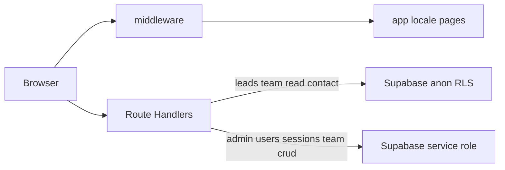

# gstack 技能與 hkfac-consultants 全局架構審查

> 產生日期：以計畫「gstack 與全局設計審查」為依據；**未修改**同目錄下的 `*.plan.md` 原檔。

## 1. gstack 技能掛載（`locate-gstack` 結論）

- **本倉庫**與 **`~/.cursor/skills-cursor`** 內**未內建**名為 `gstack-*` 的 `SKILL.md`（已搜尋）。
- 其他專案常見名稱：`gstack-investigate`、`gstack-plan-design-review`、`gstack-plan-eng-review`、`gstack-qa-only`。
- **若需嚴格依官方步驟執行**：請將任一 `gstack-*/SKILL.md` 複製到本機可讀路徑（例：`%USERPROFILE%\.cursor\skills-cursor\gstack-plan-design-review\SKILL.md`），或在 Cursor 規則中直接 `@` 該文件。
- 下文本節為**不依賴**該 `SKILL.md` 全文的**等效全局審查摘要**，可與 gstack 原文補讀併用。

## 2. 全局架構與邊界（`run-skill-steps` 等效）



| 層 | 要點 |
|----|------|
| **i18n** | `next-intl`，`localePrefix: "always"`；`/` 依 `Accept-Language` 導向 `/en`、`/zh-HK` 或 `/zh-CN`。 |
| **託管** | OpenNext + `wrangler.jsonc`、Cloudflare（`public/_headers` 靜態快取等）。 |
| **公開讀/寫** | Anon + RLS：前台讀 `team_members`（活躍行）、聯絡寫入 `leads`（`app/api/contact` + `lib/contact-rate-limit` 進程內限流）。 |
| **後台** | `admin_session` Cookie + 路由內邏輯 + **僅服務端** `SUPABASE_SERVICE_ROLE_KEY` 寫庫。RLS 無法讀 Cookie；敏感表依「無 public policy + service 繞過」收斂。 |
| **密碼** | `bcryptjs`（`lib/password.ts`），登入成功可自舊明文欄位升級為 bcrypt 雜湊。 |

## 3. 風險與缺口（精簡）

| 主題 | 說明 |
|------|------|
| 限流 | 聯絡表單已加 **郵件 + 客戶端 IP** 的滾動 1h 次數；**非分佈式**，多實例下應在 **Cloudflare 儀表板** 加 **Rate rules / WAF** 作為權威。 |
| 會話 | `ADMIN_SESSION_SECRET` 在示例有、**尚未**用於簽名 Cookie；若需降低 middleware 內部對 `verify-session` 的 `fetch` 次數，可另行設計簽名會話（屬行為變更）。 |
| 可觀測性 | 多處 `console.*`；上線排障以 **Cloudflare / Supabase 日誌** 為主。 |

## 4. 生產運維驗證清單（`ops-verify`）

請在佈署環境**逐項手動**勾選（自動化帳密無法代填）。

- [ ] **Cloudflare**（Pages / Workers 建立變量）：`NEXT_PUBLIC_SUPABASE_URL`、`NEXT_PUBLIC_SUPABASE_ANON_KEY`、`SUPABASE_SERVICE_ROLE_KEY`、`RESEND_API_KEY`（如用郵件）、`NODE_VERSION` 與 `engines` 一致。
- [ ] **嚴禁** 將 `SUPABASE_SERVICE_ROLE_KEY` 設成 `NEXT_PUBLIC_*` 或客戶端讀取。
- [ ] **Supabase SQL Editor**：已執行倉內 `supabase-rls-hardening.sql`（及既有 `leads` 的 anon insert 策略需仍存在）。
- [ ] **登入**：`/en/admin/login`（或 `zh-HK` / `zh-CN`）`mark@hkfac.com` + 密碼，後台導向正常；登出清 Cookie。
- [ ] **顧問 API**：`GET/POST/PATCH/DELETE` `api/admin/team*`，在已登入 Cookie 下成功。
- [ ] **前台**：多語首頁、`team_members` 展示、聯絡表單一筆寫入 `leads`（Supabase 表內可見）。

## 5. 可選加固本輪實作（`optional-hardening` 之一）

- **聯絡表單**：新增 [`lib/contact-rate-limit.ts`](../lib/contact-rate-limit.ts)（每 email 每小時最多 5 次、每客戶端 IP 每小時最多 20 次，滾動窗），[`app/api/contact/route.ts`](../app/api/contact/route.ts) 已改為使用該邏輯。邊緣層補防仍建議在 Cloudflare 配額。

- **分佈式限流、會話簽名、middleware 去 `fetch` 驗證** 屬架構變更，**未**在本輪一併改寫，僅在本節記錄後續選項。

## 6. 本地釋出前命令（工程師自檢）

在倉庫根目錄執行：

```bash
npm run build
npm run build:cf
```

（`build:cf` 需能解析 Cloudflare 建置產物；Windows 上 OpenNext 或提示建議用 WSL，屬上游提示。）
