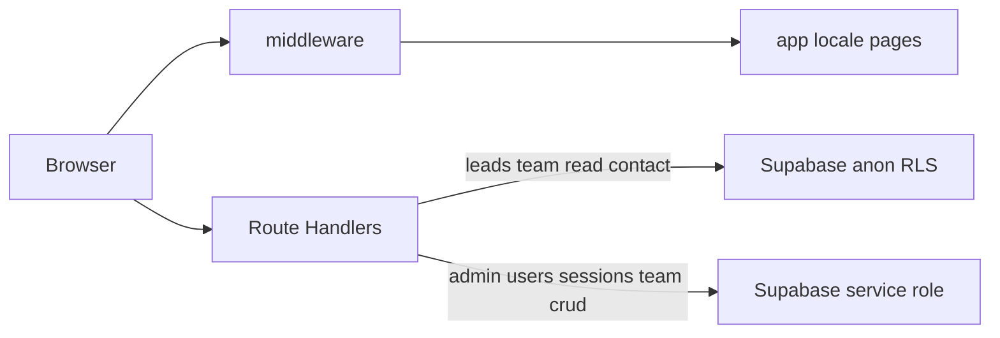

# gstack 技能與 hkfac-consultants 全局架構審查

> 產生日期：以計畫「gstack 與全局設計審查」為依據；**未修改**同目錄下的 `*.plan.md` 原檔。

## 1. gstack 技能掛載（`locate-gstack` 結論）

- **本倉庫**與 **`~/.cursor/skills-cursor`** 內**未內建**名為 `gstack-*` 的 `SKILL.md`（已搜尋）。
- 其他專案常見名稱：`gstack-investigate`、`gstack-plan-design-review`、`gstack-plan-eng-review`、`gstack-qa-only`。
- **若需嚴格依官方步驟執行**：請將任一 `gstack-*/SKILL.md` 複製到本機可讀路徑（例：`%USERPROFILE%\.cursor\skills-cursor\gstack-plan-design-review\SKILL.md`），或在 Cursor 規則中直接 `@` 該文件。
- 下文本節為**不依賴**該 `SKILL.md` 全文的**等效全局審查摘要**，可與 gstack 原文補讀併用。

## 2. 全局架構與邊界（`run-skill-steps` 等效）



| 層 | 要點 |
|----|------|
| **i18n** | `next-intl`，`localePrefix: "always"`；根路徑 `pathname === "/"` 在 [`middleware.ts`](../middleware.ts) 內**固定** `redirect` 至 `/en`（與行銷「預設英文」策略一致，非每請求做 `Accept-Language` 協商）。 |
| **託管** | OpenNext（[`open-next.config.ts`](../open-next.config.ts)）。兩份 Wrangler 配置見下節 **Cloudflare 託管與 HTML 404**。`public/_headers` 靜態快取等。 |
| **公開讀/寫** | Anon + RLS：前台讀 `team_members`（活躍行）、聯絡寫入 `leads`（`app/api/contact` + `lib/contact-rate-limit` 進程內限流）。 |
| **後台** | `admin_session` Cookie + 路由內邏輯 + **僅服務端** `SUPABASE_SERVICE_ROLE_KEY` 寫庫。RLS 無法讀 Cookie；敏感表依「無 public policy + service 繞過」收斂。 |
| **密碼** | `bcryptjs`（`lib/password.ts`）；`admin_users.password_hash` 應只存 bcrypt；可用 `npm run hash:admin-password` 產生哈希。 |

## 2.1 Cloudflare 託管與 HTML 404（邊緣層，對齊 gstack）

**觀測（生產，`curl` HEAD）：** `/` → `301` 到 `/en`（`public/_redirects` 或邊緣層可見）；**`/en` → `404`**。這與「靜態資產上傳成功、但 **OpenNext 的 `worker.js` 未作為處理 HTML/SSR 的 Worker 掛在 Pages Git 產出上**」一致；Next 的 `middleware` 與 `app/[locale]` 若未在 Worker 內執行，不會產生 HTML，僅有靜態路徑時表現為 404。

| 檔案 | 用途 |
|------|------|
| [`wrangler.json`](../wrangler.json) | **僅** `name` + `pages_build_output_dir: ".open-next"`。給 **Cloudflare Pages**（Git 整合）讀建置產出目錄。與同檔內的 `main` + `pages_build_output_dir` 互斥，故不可二合一。 |
| [`wrangler.deploy.json`](../wrangler.deploy.json) | **Workers** 部署專用：`main` → `.open-next/worker.js`、`assets` → `.open-next/assets`、`nodejs_compat` 等。**OpenNext 官方敘事以 Worker 運行全站**；用此檔執行 `wrangler deploy` 才是完整管線。 |

**建議的生產發佈（二選一或併用）：**

1. **Workers（推薦，解決 /en 404）**  
   - 本地或 CI：先 [`npm run build:cf`](../package.json)，再 `npm run deploy:worker`（`wrangler deploy --config wrangler.deploy.json`）。  
   - 帳戶已登入 Wrangler 或設 `CLOUDFLARE_API_TOKEN` / `CLOUDFLARE_ACCOUNT_ID`。  
   - 在 Cloudflare 儀表板把**自定義網域**或流量指向該 **Worker**（`*.workers.dev` 或綁定域名），不要只依賴 **Pages 專案**若該專案僅上傳靜態。  

2. **僅 Pages Git 建置**  
   - 可繼續產生 `.open-next` 用於快取/預覽，但若平台上仍不掛 `worker.js`，**HTML 路徑仍可能 404**；此時應以 Cloudflare 文檔或 **GitHub Actions** 改為併用 `deploy:worker`（見 [`.github/workflows/deploy-opennext.yml`](../.github/workflows/deploy-opennext.yml)）。  

3. **勿**在產出目錄內自造 `_worker.js` 僅 `export` 自 `worker.js`：曾觸發 **Pages 對 `_worker.js` 二次 esbuild**，導致 `async_hooks` / `fs` 等 Node 內建解析失敗。  

4. **GitHub Actions**：`deploy-opennext.yml` 在 `push` 至 `main` 時可部署 Worker；需設定 Secrets：`CLOUDFLARE_API_TOKEN`、`CLOUDFLARE_ACCOUNT_ID`；**建置階段**內聯的 `NEXT_PUBLIC_SUPABASE_*` 建議以 Secrets 注入。  

## 3. 風險與缺口（精簡）

| 主題 | 說明 |
|------|------|
| 限流 | 聯絡表單已加 **郵件 + 客戶端 IP** 的滾動 1h 次數；**非分佈式**，多實例下應在 **Cloudflare 儀表板** 加 **Rate rules / WAF** 作為權威。 |
| 會話 | `ADMIN_SESSION_SECRET` 在示例有、**尚未**用於簽名 Cookie；若需降低 middleware 內部對 `verify-session` 的 `fetch` 次數，可另行設計簽名會話（屬行為變更）。 |
| 可觀測性 | 多處 `console.*`；上線排障以 **Cloudflare / Supabase 日誌** 為主。 |
| 邊緣 HTML | 若自託管未經 **完整 Worker 部署**（`worker.js` + `ASSETS`），**HTML 與 RSC 路由不可達**；見 §2.1。 |

## 4. 生產運維驗證清單（`ops-verify`）

請在佈署環境**逐項手動**勾選（自動化帳密無法代填）。

- [ ] **Cloudflare**（**Workers** 或 Pages 的 Build/Runtime 變量）：`NEXT_PUBLIC_SUPABASE_URL`、`NEXT_PUBLIC_SUPABASE_ANON_KEY`、`SUPABASE_SERVICE_ROLE_KEY`、`RESEND_API_KEY`（如用郵件）、`NODE_VERSION` 與 `engines` 一致。  
- [ ] **生產 HTML**：確認流量指向 **已部署 OpenNext 的 Worker**；`curl -I https://<你的站>/en` 應 **非** 404。  
- [ ] **嚴禁** 將 `SUPABASE_SERVICE_ROLE_KEY` 設成 `NEXT_PUBLIC_*` 或客戶端讀取。  
- [ ] **Supabase SQL Editor**：已執行倉內 `supabase-rls-hardening.sql`（及既有 `leads` 的 anon insert 策略需仍存在）。  
- [ ] **登入**：`/en/admin/login`（或 `zh-HK` / `zh-CN`）+ 帳密，後台導向正常；登出清 Cookie。  
- [ ] **顧問 API**：`GET/POST/PATCH/DELETE` `api/admin/team*`，在已登入 Cookie 下成功。  
- [ ] **前台**：多語首頁、`team_members` 展示、聯絡表單一筆寫入 `leads`（Supabase 表內可見）。  

## 5. 可選加固本輪實作（`optional-hardening` 之一）

- **聯絡表單**：新增 [`lib/contact-rate-limit.ts`](../lib/contact-rate-limit.ts)（每 email 每小時最多 5 次、每客戶端 IP 每小時最多 20 次，滾動窗），[`app/api/contact/route.ts`](../app/api/contact/route.ts) 已改為使用該邏輯。邊緣層補防仍建議在 Cloudflare 配額。  

- **分佈式限流、會話簽名、middleware 去 `fetch` 驗證** 屬架構變更，**未**在本輪一併改寫，僅在本節記錄後續選項。  

## 6. 本地釋出前命令（工程師自檢）

在倉庫根目錄執行：

```bash
npm run build
npm run build:cf
```

（`build:cf` 需能解析 Cloudflare 建置產物；Windows 上 OpenNext 或提示建議用 WSL，屬上游提示。）  

**部署至 Workers（生產 HTML 可達）：** 需已 `wrangler login` 或 CI Secrets，執行：

```bash
npm run deploy:worker
```

**勿**在缺少憑證的環境強制推送後期待 Pages 單階段產生完整 SSR，見 §2.1。
